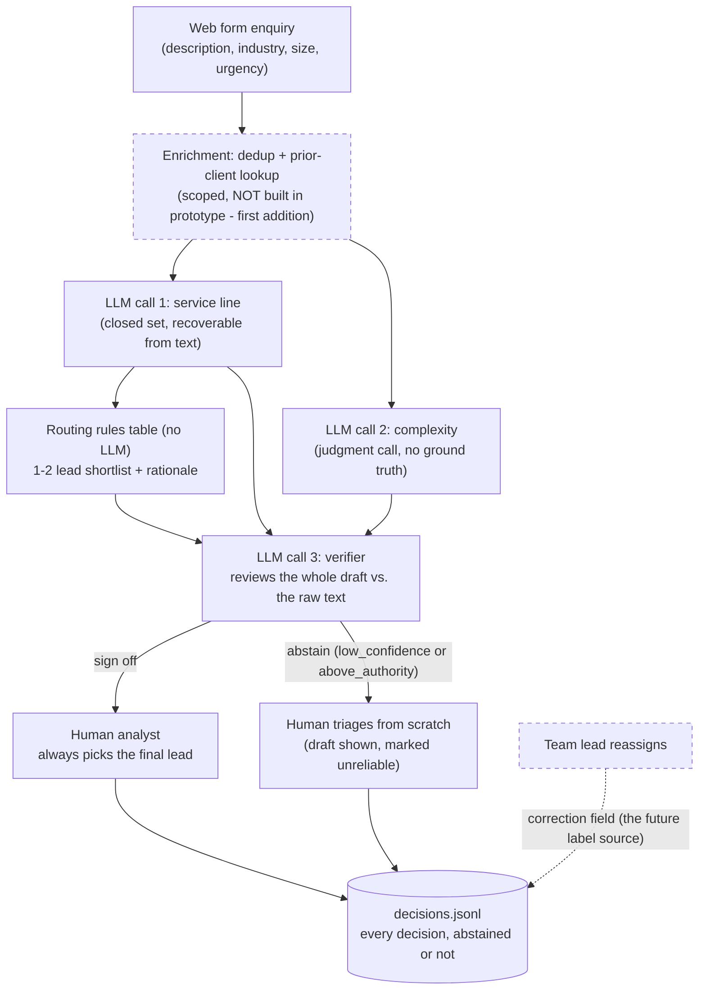

# Architecture

One diagram plus notes. At 40-60 enquiries/week this is honestly a
four-box system, and drawing it bigger would misrepresent it - see
docs/DECISIONS.md ("an honest architecture is four boxes").

Dashed boxes are designed but not built in the prototype.

## Data flow

Form submission in -> two independent LLM classification calls -> a
deterministic routing lookup -> one LLM verifier call over the assembled
draft -> a human. Three LLM calls per enquiry, ~2,600 enquiries/year,
single-digit dollars annually. Everything is a synchronous batch script a
person runs; there is no service, queue, or database, and none is
justified below roughly 5,000 enquiries/week.

## Model / API choices

One model constant (`src/config.py`), strongest available Claude model
for all three calls - at this volume the cost difference between tiers is
noise and accuracy on the subtle cases is the entire game. Structured
output via forced tool-use against pydantic-generated JSON schemas, so a
malformed response is a logged error, never a silently coerced guess.

## Integration points (in production, none built here)

- **In**: the web form's existing submission handler appends to the same
  intake file the script reads. No API needed at this volume.
- **Out**: the analyst's queue - realistically email or the firm's
  ticketing tool - receives the draft decision and shortlist.
- **Later**: CRM lookup for the prior-client enrichment, and a one-click
  "reassign" action for leads that writes the correction field.

## Instrumented from day one

1. Every decision logged whole to `decisions.jsonl`, including abstains,
   with rationale text per stage - already built.
2. The `correction` field on every logged decision - reserved in the
   schema now - so a team lead's reassignment joins back to the original
   decision as a free training label. Silent misroutes are the primary
   failure mode; this is the only signal that catches them.
3. Abstain rate split by trigger, and routing shortlist recall vs. top-1,
   tracked separately because they degrade for different reasons (see
   WRITEUP.md).
